## Setup and overview 

<!-- ::: {.incremental} -->

Copula-based probability models
$$
\underbrace{H(x_1,\ldots, x_M)}_{\text{multivariate c.d.f.}}=\underbrace{C\big(\overbrace{F_1(x_1),\ldots,F_M(x_M)}^{\text{univariate marginal c.d.f.'s}}\big)}_{\text{copula function}} \quad \Leftrightarrow \quad 
\underbrace{h(x_1,\ldots, x_M)}_{\text{multivariate p.d.f.}}=\underbrace{c\big(F_1(x_1),\ldots,F_M(x_M)\big)}_{\text{copula density}}\prod_{m=1}^M \underbrace{f_t(x_m)}_{\text{marginal p.d.f.}}
$$

Copulas are **multivariate distributions with uniform marginals**.

Start with $M=2$; assume correctly specified marginals, known up to $\beta$:
$$
\beta\in\mathbb{R}^p \quad\text{ collects all distinct parameters of marginals}$$

Dependence is nuisance:
$$\gamma\in\mathbb{R}^{d_\gamma} \quad\text{ collects nuisance parameters of copula}$$

 Log-likelihood for a sample of size $N$ is
$$\ln L(\beta; \gamma) = \sum_{n=1}^N \Big[ \overbrace{\ln f_1 (x_{1n}; \beta) + 
\ln f_2 (x_{2n}; \beta)}^{\text{Quasi-MLE (QMLE)}} +  \overbrace{\ln c\big(F_1 (x_{1n}; \beta) ;
F_2 (x_{2n}; \beta);\gamma\big)}^{\text{nuisance}}\Big]$$

<!-- The same decomposition applies to conditional distributions. 

:::-->

<!-- ################################################################################################ -->

## Likelihood-based moment conditions

$$\ln L(\beta; \gamma) = \sum_{n=1}^N \Big[ \underbrace{\ln f_1 (x_{1n}; \beta)}_{\ln f_{1n}(\beta)} + 
\underbrace{\ln f_2 (x_{2n}; \beta)}_{\ln f_{2n}(\beta)} +  \underbrace{\ln c\big(F_1 (x_{1n}; \beta) ;
F_2 (x_{2n}; \beta);\gamma\big)}_{ \ln c_{n}(\beta, \gamma)}\Big]$$

Full MLE:
$$
\max_{\beta,\gamma}\log L(\beta,\gamma)
=
\max_{\beta,\gamma}
\sum_{n=1}^N
\left[
\ln f_{1n}(\beta)
+
\ln f_{2n}(\beta)
+
\ln c_n(\beta,\gamma)
\right].
$$

<!--$$\ln L(\beta; \gamma) = \sum_{i=1}^N \Big[ {\ln f_{1i}(\beta)} + {\ln f_{2i}(\beta)} +  \ln c_{i}(\beta,\gamma)\Big]$$
-->

F.O.C.

$$
\begin{pmatrix}
\sum_{i=1}^N
\left[
\nabla_\beta \log f_{1n}(\widehat\beta)
+
\nabla_\beta \log f_{2n}(\widehat\beta)
+
\nabla_\beta \log c_n(\widehat\beta,\widehat\gamma)
\right]
\\[0.4em]
\sum_{i=1}^N
\nabla_\gamma \log c_n(\widehat\beta,\widehat\gamma)
\end{pmatrix}
=
0 .
$$

<!--Correctly specified marginals:  
$$ \exists \beta_o: \quad \mathbb{E}\nabla_\beta\ln f_1(\beta_o) =0 \quad \& \quad  \mathbb{E}\nabla_\beta\ln f_2(\beta_o)
=0$$
-->

Suppose copula is correctly specified too: 

$$\exists \beta_o, \gamma_o : 
\underbrace{\mathbb{E}\!\left[\nabla_\beta \ln f_1(\beta_o)\right]}_{=0}
+
\underbrace{\mathbb{E}\!\left[\nabla_\beta \ln f_2(\beta_o)\right]}_{=0}
+
\mathbb{E}\!\left[\nabla_\beta \ln c(\beta_o,\gamma_o)\right]
=0,
$$
$$
\mathbb{E}\!\left[\nabla_\gamma \ln c(\beta_0,\gamma_o)\right]=0.
$$

<!-- Correctly specified copula:  
$$ \exists \gamma_o: \quad \text{ at the same } \beta_o, \quad \mathbb{E}\nabla_\beta\ln c(\beta_o, \gamma_o) =0 \quad \& \quad  \mathbb{E}\nabla_\gamma\ln c(\beta_o, \gamma_o)=0$$
-->

 $\Rightarrow$ **Bias-Efficiency Trade-off:** FMLE uses marginal scores plus copula score. That can improve efficiency, but only if the copula is robust to specification.

<!--

**Question:** How to use the dependence information **efficiently** while remaining **robust** to copula misspecification?

**Note:** This covers all kinds of models with arbitrary dependence across marginals: M-GARCH, VAR, DCC, panel discrete choice, selectivity, etc.

-->

<!-- ################################################################################################ -->

## In search of the Holy Grail

$$(*)\quad\left\{\begin{matrix}
\mathbb{E}\!\nabla_\beta \ln k(\beta_0,\gamma_0^k)\ne 0
\\
\mathbb{E}\!\nabla_\gamma \ln k(\beta_0,\gamma_0^k)\ne 0
\end{matrix} \right. 
$$

A misspecified copula $k$ generally invalidates $(*)$ $\Rightarrow\widehat\beta$ inconsistent.

::: {.textbox}

A copula $k\neq c$ is **robust** if $(*)$ still hold at $\beta_0$ for a pseudo-true $\gamma_0^k\neq\gamma_0$ $\Rightarrow\widehat\beta$ consistent.

:::

Part 1. **Parametrics:** $\dim(\gamma)<\infty$

Are there robust and efficiency improving copula families? 

Part 2. **Semiparametrics:** $\dim(\gamma) = \infty$

Can a consistent nonparametric estimator of $c$ be efficiency improving?

Part 3. **Machine learning:** semiparametric with penalisation of $c$ and orthogonolised moments.

Can *robust machine learning* help?

<!-- ################################################################################################ -->

## Part 1 Parametrics {.center background-color="#2c3e50"}

:::: {.columns}
::: {.column}

  

1.   When are copulas robust?

2. When are copulas informative about $\beta$?

3. How much more efficient? 

:::
::: {.column}
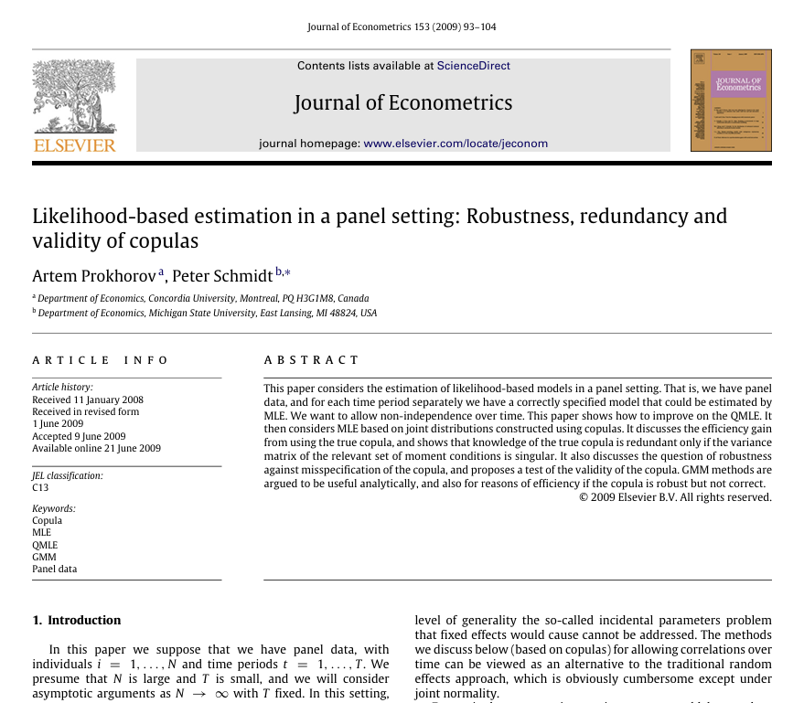
:::
::::

<!-- ################################################################################################ -->

## Available parametric estimators 

Generalised Methods of Moments (GMM) perspective:
\begin{matrix}
\left.\begin{array}{c} \left. \begin{array}{c}
(a)\quad\mathbb{E}\!\nabla_\beta \ln f_1(\beta_o) =0 \\
(b)\quad\mathbb{E}\!\nabla_\beta \ln
f_2(\beta_o) =0
\end{array}\right\}\text{QMLE}\\
\left. \begin{array}{c}
(c)\quad \mathbb{E}\!\nabla_\beta \ln c(\beta_o,\gamma_o) =0 \\
(d)\quad \mathbb{E}\!\nabla\gamma \ln c(\beta_o,
\gamma_o) =0
\end{array}\right.
\end{array}\right\}\text{FMLE}
\end{matrix}

FMLE = GMM based on  $\left[\begin{array}{c}(a)+(b)+(c)\\(d)\end{array}\right]$ versus QMLE = GMM based on ($a$)+($b$)

Optimal GMM weights

::: {.f80}

Optimal weights $\mathbb{D}'\mathbb{C}^{-1} = -\left[\begin{array}{cccc} \mathbb{I} & \mathbb{I} & \mathbb{I} & \mathbf{0}\\
\mathbf{0} & \mathbf{0} & \mathbf{0} & \mathbb{I}\end{array}\right]$ produce MLE:

$$\left[\begin{array}{cccc}
\mathbb{I} & \mathbb{I} & \mathbb{I} & \mathbf{0}\\
\mathbf{0} & \mathbf{0} & \mathbf{0} & \mathbb{I}
\end{array}\right]\left[\begin{array}{c}
(a)\\
(b)\\
(c)\\
(d)
\end{array}\right]=\left[\begin{array}{c}
(a)+(b)+(c)\\
(d)\end{array}\right]$$

:::

::: {.textbox}
Imposing a copula on marginals is equivalent to adding
moment conditions $\Rightarrow$ 

**Efficiency of estimators** $\leftrightarrow$ **Redundancy of copula moments**: 

no efficiency
gain from using the copula moments \item[$\Rightarrow$]

**Robustness of estimators** $\leftrightarrow$ **Robustness of copula moments**: 

misspecification of copula does not matter for
consistency
:::

<!-- ################################################################################################ -->

## When are copulas robust?

**Trivial answer:** The independence copula $$K(u, v) = u\cdot v \Rightarrow \mathbb{E}\nabla_{(\beta, \gamma)} \ln k(\beta_o,\gamma_o) =0$$

**Non-trivial answer:** Unknown. Problem specific.

E.g., problems where $\beta$ = the mean of $F_1$ and $F_2$:

::: {.textbox}
if the true distribution is **elliptically contoured**, any **radially symmetric** copula is robust
:::

Symmetry

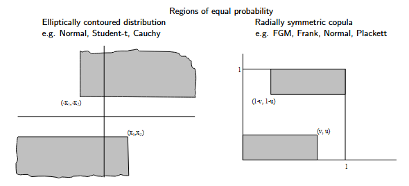{width=50%}

Use any radially symmetric copula with any $\gamma$ and still get consistent
$\widehat{\beta}$

<!-- ################################################################################################ -->

## When are copulas informative about $\beta$?

Whenever moments (c)-(d) are **non-redundant** for estimation of $\beta$ given moments (a)-(b)

**Digression on redundancy**

Consider $\qquad\mathbb{E} g(Z,\theta_o) = \left[\begin{array}{cc}
\mathbb{E}g_1(Z,\theta_o) \\
\mathbb{E}g_2(Z,\theta_o) 
\end{array}
\right]=0$

Only $g_1$ identifies $\theta$. 

$g_2$ is **redundant** given $g_1$ $\Leftrightarrow$ GMM based on only $g_1$
is as efficient as GMM based on $(g_1,g_2)$.

Notation: $\quad \mathbb{D}_1=\left[\begin{array}{c}\mathbb{E}\nabla_\theta
g_1 \\ \mathbb{E}\nabla_\theta g_2\end{array}\right] = \left[\begin{array}{c}\mathbb{D}_1 \\ \mathbb{D}_2\end{array}\right]\qquad \mathbb{C}=\left[\begin{array}{cc}\mathbb{E}g_1 g_1'&\mathbb{E}g_1 g_2' \\ \mathbb{E}g_2 g_1'&\mathbb{E}g_2 g_2'\end{array}\right] =\mathbb{V}\left[\begin{array}{c} g_{1}\\
g_{2}\end{array}\right] = \left[\begin{array}{cc} \mathbb{C}_{11}& \mathbb{C}_{12}\\
\mathbb{C}_{21}&\mathbb{C}_{22}\end{array}\right]$

$\mathbb{V}_{1}$ = asy variance of (optimal) GMM estimator of $\theta_o$ based on $g_1$

$\mathbb{V}_{1\&2}$ = asy variance of (optimal) GMM estimator of $\theta_o$ based on $(g_1, g_2)$

::: {.textbox}
$g_2$ is **redundant** $\Leftrightarrow \mathbb{V}_{1}=\mathbb{V}_{1\&2} \Leftrightarrow \mathbb{D}_2=\mathbb{C}_{21}\mathbb{C}^{-1}_{11}\mathbb{D}_1$
::: 

---

**Digression on redundancy, cont'd**

Derivation of redundancy condition

::: {.f80}

::: {.textbox-white}

Look at part of $g_1$ not explained by $g_2$. Denote it by $g_1\perp g_2$. 

$(g_1 \perp g_2) = g_1 - \mathbb{C}_{21}\mathbb{C}^{-1}_{11} g_2$.

Note GMM based on $g_1$ and $g_2$ = GMM based on $(g_1 \perp g_2)$ and  $g_2$ $\Rightarrow \mathbb{V}_{1\&2} = \mathbb{V}_{(1\perp 2)\&2}$.

But correlation between the moments has been made zero $\Rightarrow$ easy to compare $\mathbb{V}_{(1\perp 2)\&2}$ with $\mathbb{V}_{1}$.

$\mathbb{V}_{1} = \mathbb{V}_{(1\perp 2)\&2} \Leftrightarrow  \mathbb{E}\nabla_\theta[ g_1 - \mathbb{C}_{21}\mathbb{C}^{-1}_{11} g_2]=\mathbb{D}_2-\mathbb{C}_{21}\mathbb{C}^{-1}_{11}\mathbb{D}_1=0$

:::
::: 

Examples of redundancy

::: {.f80}

::: {.textbox-white}

**Numerical redundancy**

\begin{array}{l}
\mathbb{E}(Z - \mu) =0 \\
\mathbb{E}[25\times(Z-\mu)] =0
\end{array} 

Note that $\mathbb{C}$ is singular here
:::

::: {.textbox-white}

**Statistical but not numerical redundancy**

\begin{array}{l}
\mathbb{E}(Z - \mu) =0 \\
\mathbb{E}[(Z-\mu)^2-\sigma^2] =0 \quad \text{($\sigma^2$ is
known)}
\end{array}

Here $g_2$ is redundant given $g_1 \Leftrightarrow \mathbb{E}(Z-\mu)^3=0$
:::
:::

M/P-redundancy

::: {.f80}

::: {.textbox-white}

Sometimes extra knowledge has two forms: (i) knowledge of moment; (ii) knowledge of true value of parameter.

Consider 

\begin{array}{cc}
\text{[A] for }\theta_1:&\mathbb{E}g_{1}(\theta_1, \theta_2)=0 \\     
\text{[B] for }\theta_2:&\mathbb{E}g_{2}(\theta_2)=0 
\end{array}

**M-redundancy:** Fix $\theta_2$ at true value. When knowledge of [B] does not help reduce $\mathbb{V}(\widehat{\theta}_1)$. 

**P-redundancy:** Fix [A]\&[B]. When knowledge of true $\theta_2$ does not help reduce $\mathbb{V}(\widehat{\theta}_1)$. 

Notation:  $\quad \mathbb{C}=\mathbb{E}gg'=\left[\begin{array}{cc}\mathbb{C}_{11} & \mathbb{C}_{12}\\
\mathbb{C}_{21} & \mathbb{C}_{22}\end{array}\right] \quad \mathbb{D}=\left[\begin{array}{cc}\mathbb{D}_{11} & \mathbb{D}_{12}\\
0 & \mathbb{D}_{22}\end{array}\right] \quad \mathbb{D}_{22}$ and $\mathbb{D}_{12}$ vanish if true $\theta_2$ is known.

$$\mathbb{V}(\widehat{\theta}_1)_{\text{GMM based on [A] with $\theta_2$ known}} \stackrel{?}{=}\mathbb{V}(\widehat{\theta}_1)_{\text{GMM based on [A]&[B] with $\theta_2$ unknown}}$$

::: {.textbox}
$\textbf{M/P-redundancy} \Leftrightarrow \left\{\begin{matrix}
 \mathbb{C}_{12}=0  \quad \text{Moment redundancy of [B]}   \\
 \mathbb{D}_{12}=0 \quad \text{Parameter redundancy of $\theta_2$} 
\end{matrix}\right.$

::: 

:::

::: 

**End of digression**

<!-- ################################################################################################ -->

## Redundancy of true copula

<!--
::: {.f70}

Recall the moment conditions:
 
\begin{array}{c} 
(a)\quad\mathbb{E}\nabla_\beta \ln f_1(\beta_o) =0 \\
(b)\quad\mathbb{E}\nabla_\beta \ln f_2(\beta_o) =0\\
(c)\quad \mathbb{E}\nabla_\beta \ln c(\beta_o,\gamma_o) =0 \\
(d)\quad \mathbb{E}\nabla_\gamma \ln c(\beta_o, \gamma_o) =0
\end{array}

:::
-->

Suppose $\ln c$ is correctly specified and $\gamma = \gamma_o$ is known. Relevant moments:

\begin{array}{c} 
(a)\quad\mathbb{E}\nabla_\beta \ln f_1(\beta_o) =0 \\
(b)\quad\mathbb{E}\nabla_\beta \ln f_2(\beta_o) =0\\
(c)\quad \mathbb{E}\nabla_\beta \ln c(\beta_o) =0
\end{array}

What are $\mathbb{D}$ and $\mathbb{C}$? When is $\mathbb{D}_2=\mathbb{C}_{21}\mathbb{C}^{-1}_{11}\mathbb{D}_1$?

 Derivation 

::: {.f60}

:::: {.columns}

::: {.column width="70%"}

$$\mathbb{D} = \left[\begin{array}{cc}
-\mathbf{A}\\
-\mathbf{B}\\
\hline
\mathbf{G}+\mathbf{G'}-\mathbf{J}
\end{array}\right]\quad \text{and}\quad \mathbb{C} = \left[\begin{array}{cc|c}
\mathbf{A} & \mathbf{G} &  -\mathbf{G} \\
\mathbf{G'} & \mathbf{B} & -\mathbf{G'} \\
\hline
-\mathbf{G'} & -\mathbf{G} &  \mathbf{J} 
\end{array}\right]$$

:::

::: {.column width="20%"}

**Note** common elements in $\mathbb{D}$ and $\mathbb{C}$ due to information equalities.

:::

::::

:::: {.columns}

::: {.column width="20%"}

$$\mathbb{D}_2=\mathbb{C}_{21}\mathbb{C}^{-1}_{11}\mathbb{D}_1:$$

:::

::: {.column width="80%"}

$$\mathbf{G}+\mathbf{G}'-\mathbf{J} = \begin{pmatrix}
-\mathbf{G'}&-\mathbf{G}\end{pmatrix} \begin{pmatrix}
\mathbf{A}&\mathbf{G}\\\mathbf{G}'&\mathbf{B}\end{pmatrix}^{-1}\begin{pmatrix}
-\mathbf{A}\\-\mathbf{B}\end{pmatrix} \Rightarrow \mathbf{J}=\begin{pmatrix}
-\mathbf{G}&-\mathbf{G}\end{pmatrix}\begin{pmatrix}\mathbf{A} & \mathbf{G}\\
\mathbf{G}' &
\mathbf{B}\end{pmatrix}^{-1}\begin{pmatrix}-\mathbf{G} \\
-\mathbf{G}' \end{pmatrix}$$

$$\Rightarrow \mathbb{E}\left\{\underbrace{\nabla_\beta \ln
c}_{\text{(c)}}\underbrace{\left(\nabla_\beta
\ln c - \left[\begin{array}{cc} \nabla_\beta
\ln f_1& \nabla_\theta \ln f_2
\end{array}\right]\overbrace{\left[\begin{matrix}
\mathbf{A} & \mathbf{G}\\
\mathbf{G}' & \mathbf{B}\end{matrix}\right]^{-1}\left[\begin{array}{c}
-\mathbf{G}\\-\mathbf{G}'\end{array}\right]}^{=\mathbb{B}}
\right)}_{\text{error in projection of (c) on (a) and (b)}}
\right\} =\mathbf{0}
$$

:::

::::

:::

::: {.textbox}

<!-- - (a)-(b) are uncorrelated iff they are uncorrelated with (c)

- Optimal GMM weights on (a)-(d) produce FMLE -->

- $(c)$ for true copula is redundant $\Leftrightarrow$ $(c)$ is a linear combination of $(a)$ and $(b)$.

- Only numerical redundancy is possible; $\mathbb{C}$ is singular.

- Redundant copulas are robust under correct specification of marginals.

- QMLE is asy efficient $\Leftarrow$ $\nabla_\beta \ln c \in$ linear span of $\left(\begin{matrix}\nabla_\beta \ln f_1 \\ \nabla_\beta \ln f_2\end{matrix} \right)$. 
:::

<!--
$$ \mathbb{D}=\left[\begin{array}{c}
\mathbb{D}_{1}  \\
\hline
\mathbb{D}_{2} 
\end{array}\right]\left[\begin{array}{c}
\mathbb{D}_{a\beta}  \\
\mathbb{D}_{b\beta}  \\
\hline
\mathbb{D}_{c\beta} \\
\mathbb{D}_{d\beta} 
\end{array}\right]\quad\text{and}\quad\mathbb{C}=\left[\begin{array}{cc|cc}
\mathbb{C}_{aa} & \mathbb{C}_{ab} & \mathbb{C}_{ac} & \mathbb{C}_{ad} \\
\mathbb{C}_{ba} & \mathbb{C}_{bb} & \mathbb{C}_{bc} & \mathbb{C}_{bd} \\
\hline
\mathbb{C}_{ca} & \mathbb{C}_{cb}&  \mathbb{C}_{cc} & \mathbb{C}_{cd} \\
\mathbb{C}_{da} & \mathbb{C}_{db} & \mathbb{C}_{dc} & \mathbb{C}_{dd}
 \end{array}\right]
$$
-->

<!-- ################################################################################################ -->

## Redundancy of estimated copula

- correctly specified, unknown $\gamma$

- incorrectly specified but robust, unknown $\gamma$

Full D and C and information equalities

::: {.f50}

:::: {.columns}

::: {.column width="15%"}

\begin{array}{c} 
(a)\quad\mathbb{E}\nabla_\beta \ln f_1(\beta_o) =0 \\
(b)\quad\mathbb{E}\nabla_\beta \ln f_2(\beta_o) =0\\
(c)\quad \mathbb{E}\nabla_\beta \ln c(\beta_o,\gamma_o) =0 \\
(d)\quad \mathbb{E}\nabla_\gamma \ln c(\beta_o, \gamma_o) =0
\end{array}

:::

::: {.column width="40%"}

$$\Rightarrow \mathbb{D}=\left[\begin{array}{c|c}
\mathbb{D}_{a\beta} & 0 \\
\mathbb{D}_{b\beta} & 0 \\
\hline
\mathbb{D}_{c\beta} & \mathbb{D}_{c\gamma}\\
\mathbb{D}_{d\beta} & \mathbb{D}_{d\gamma}
\end{array}\right], \mathbb{C}=\left[\begin{array}{cc|cc}
\mathbb{C}_{aa} & \mathbb{C}_{ab} & \mathbb{C}_{ac} & \mathbb{C}_{ad} \\
\mathbb{C}_{ba} & \mathbb{C}_{bb} & \mathbb{C}_{bc} & \mathbb{C}_{bd} \\
\hline
\mathbb{C}_{ca} & \mathbb{C}_{cb}&  \mathbb{C}_{cc} & \mathbb{C}_{cd} \\
\mathbb{C}_{da} & \mathbb{C}_{db} & \mathbb{C}_{dc} & \mathbb{C}_{dd}
 \end{array}\right],
$$
:::

::: {.column width="10%"}

$\mathbb{D}_{a\beta}=-\mathbb{C}_{aa}$

$\mathbb{D}_{b\beta}=-\mathbb{C}_{bb}$

$\mathbb{D}_{c\gamma}=-\mathbb{C}_{cd}$

etc.

:::

::: {.column width="30%"}

$$\Rightarrow\mathbb{D}=\left[\begin{array}{c|c}
-\mathbf{A} & \mathbf{0} \\
-\mathbf{B} & \mathbf{0} \\
\hline
\mathbf{G}+\mathbf{G'}-\mathbf{J}& -\mathbf{E} \\
-\mathbf{E}' & -\mathbf{F}
\end{array}\right], \mathbb{C}=\left[\begin{array}{cc|cc}
\mathbf{A} & \mathbf{G} &  -\mathbf{G} & \mathbf{0} \\
\mathbf{G'} & \mathbf{B} & -\mathbf{G'} & \mathbf{0} \\
\hline
-\mathbf{G'} & -\mathbf{G} &  \mathbf{J} & \mathbf{E} \\
\mathbf{0} & \mathbf{0} & \mathbf{E'} & \mathbf{F}
\end{array}\right]$$

:::

::::

:::: {.columns}

::: {.column width="15%"}

\begin{array}{c} 
(a)\quad\mathbb{E}\nabla_\beta \ln f_1(\beta_o) =0 \\
(b)\quad\mathbb{E}\nabla_\beta \ln f_2(\beta_o) =0\\
(c)\quad \mathbb{E}\nabla_\beta \ln k(\beta_o,\gamma_o) =0 \\
(d)\quad \mathbb{E}\nabla_\gamma \ln k(\beta_o, \gamma_o) =0
\end{array}

:::

::: {.column width="40%"}

$$\Rightarrow \mathbb{D}=\left[\begin{array}{c|c}
\mathbb{D}_{a\beta} & 0 \\
\mathbb{D}_{b\beta} & 0 \\
\hline
\mathbb{D}_{c\beta} & \mathbb{D}_{c\gamma}\\
\mathbb{D}_{d\beta} & \mathbb{D}_{d\gamma}
\end{array}\right], \mathbb{C}=\left[\begin{array}{cc|cc}
\mathbb{C}_{aa} & \mathbb{C}_{ab} & \mathbb{C}_{ac} & \mathbb{C}_{ad} \\
\mathbb{C}_{ba} & \mathbb{C}_{bb} & \mathbb{C}_{bc} & \mathbb{C}_{bd} \\
\hline
\mathbb{C}_{ca} & \mathbb{C}_{cb}&  \mathbb{C}_{cc} & \mathbb{C}_{cd} \\
\mathbb{C}_{da} & \mathbb{C}_{db} & \mathbb{C}_{dc} & \mathbb{C}_{dd}
 \end{array}\right],
$$
:::

::: {.column width="10%"}

$\mathbb{D}_{a\beta}=-\mathbb{C}_{aa}$

$\mathbb{D}_{b\beta}=-\mathbb{C}_{bb}$

only 

:::

::: {.column width="30%"}

$$\Rightarrow \mathbb{D}=\left[\begin{array}{c|c}
-\mathbf{A}  & \mathbf{0} \\
-\mathbf{B}  & \mathbf{0} \\
\hline
\mathbf{K}'+\mathbf{L}-\mathbf{M}  & -\mathbf{S} \\
\mathbf{P}'+\mathbf{Q}-\mathbf{R} & -\mathbf{T}
 \end{array}\right], \mathbb{C}=\left[\begin{array}{cc|cc}
\mathbf{A} & \mathbf{G}   & -\mathbf{K} & -\mathbf{P} \\
\mathbf{G'} & \mathbf{B}  & -\mathbf{L'} & -\mathbf{Q}' \\
\hline
-\mathbf{K}' & -\mathbf{L} & \mathbf{N} & \mathbf{V} \\
-\mathbf{P}' & -\mathbf{Q}  & \mathbf{V}' & \mathbf{W}
\end{array}\right]$$

:::

::::

:::

::: {.textbox}

- $(c)$-$(d)$ for correctly specified copula are redundant  $\Leftrightarrow$ $(c)$ is a linear combination of $(a)$, $(b)$ and $(d)$.  

- only numerical redundancy is possible for correctly specified copulas; $\mathbb{C}$ is singular.

- if the true copula is redundant then any robust copula is redundant for the estimation of $\beta$.

- QMLE is asy efficient $\Leftarrow$ $\nabla_\beta \ln c \in$ linear span of $\left(\begin{matrix}\nabla_\beta \ln f_1 \\ \nabla_\beta \ln f_2\end{matrix} \right)$

$\quad\quad\quad\quad\quad\quad\quad\quad\quad \Leftarrow \nabla_\beta \ln c \in$ linear span of $\left(\begin{matrix}\nabla_\beta \ln f_1 \\ \nabla_\beta \ln f_2 \\ \nabla_\gamma \ln c\end{matrix}\right)$.

:::

<!-- ################################################################################################ -->

## Examples

Example 1: mean of normals 

::: {.f70}
Bivariate normal with common mean and known $\rho_o$

$$\left(\begin{array}{c} X_1 \\ X_2 \end{array}\right)\sim
\mathbb{N}\left(\left[\begin{array}{c}\mu\\\mu\end{array}\right],
\left[\begin{array}{cc}1&\rho\\\rho& 1 \end{array}\right]\right)$$

After some algebra:

\begin{array}{lc}
(a)&  \mathbb{E}\left\{X_1 - \mu\right\} =0  \\
 (b)& \mathbb{E}\left\{X_2 - \mu \right\}=0  \\
 (c) &\mathbb{E}\left\{-{\frac { \left( (X_1-\mu)+(X_2-\mu) \right)
\rho_o}{\rho_o+1}} \right\} =0
\end{array}

$(c)$ is a linear combination of $(a)$ and $(b)$ ($\mathbb{C}$ is singular) $\Leftrightarrow$ $(c)$ and $(d)$ are **numerically redundant**  and
any other robust copula is redundant given $(a)$ and $(b)$

$$
\mathbb{V}_{\text{QMLE}}=\mathbb{V}_{\text{FMLE}}=\frac{1+\rho_o}{2}
$$

QMLE of $\mu$ is efficient

:::

 Example 2: variance of normals 

::: {.f70}

Bivariate normal with common variance

$$\left(\begin{array}{c} X_1 \\ X_2 \end{array}\right)\sim
\mathbb{N}\left(\left[\begin{array}{c}0\\0\end{array}\right],
\left[\begin{array}{cc}\sigma^2&\gamma\\\gamma& \sigma^2
\end{array}\right]\right)$$

\begin{array}{lc}
(a) & \mathbb{E}\left\{\frac {{X_1}^{2}-\sigma^2}{2 \sigma^4}\right\} =0 \\
(b) &\mathbb{E}\left\{\frac {{X_2}^{2}-\sigma^2}{2 \sigma^4} \right\}=0 \\
(c) &\mathbb{E}\left\{- \frac { \left( \left( 3 \gamma
{\sigma}^{4}-{\gamma}^{3} \right) ({X}^{2}_1+{X}^{2}_2)-4 {\sigma}^{
6}X_1 X_2-2 \sigma^{2}\gamma(\sigma^4-\gamma^{2})
 \right) \gamma}{2 \left(
\sigma^2-\gamma
 \right) ^{2} \left( \sigma^2+\gamma \right) ^{2}{\sigma}^{2}}
 \right\} =0 \\
(d) &\mathbb{E}\left\{-{\frac {{\gamma} \sigma^{2}(X^2_1+X^2_2) -
(\gamma^2+\sigma^4)X_1 X_2 -\gamma(\sigma^4-\gamma^2)}{ \left(
\sigma^2+\gamma \right) ^{2 } \left( \sigma^2-\gamma \right) ^{2}}}
\right\}=0
\end{array}

$(c)$ is not a linear combination of $(a)$ and $(b)$ with
$\gamma_o$ known. But $(c)$ is a linear combination of $(a)$, $(b)$, and $(d)$
($\mathbb{C}$ is singular.) $\Leftrightarrow$ $(c)$ and
$(d)$ are redundant for $\sigma^2$ given $(a)$ and $(b)$.

$$\mathbb{V}_\text{QMLE} =
\mathbb{V}_\text{MLE}=\sigma^4+\gamma^2$$

QMLE of $\sigma^2$ is efficient

:::

 Example 3: robust and non-redundant copula 

::: {.f70}

Logistic marginal  pdf $f$ [cdf $F$] with mean $\mu$ and FGM copula with parameter $\gamma$.

\begin{array}{cc}
(a)& \mathbb{E} \frac{1-e^{-X_1+\mu}}{1+e^{-X_1+\mu}}=0\\
(b)& \mathbb{E} \frac{1-e^{-X_2+\mu}}{1+e^{-X_2+\mu}}=0 \\
(c)& \mathbb{E}\left\{\frac{2\gamma[(-1+2F_1)f_2+(-1+2F_2)f_1]}{1+\gamma -2\gamma F_1 -2\gamma F_2 +4 \gamma F_1 F_2}\right\}=0\\
(d)& \mathbb{E}\left\{\frac{1-F_1-F_2 +4F_1 F_2}{1+\gamma -2\gamma F_1
-2\gamma F_2 +4 \gamma F_1 F_2}\right\}=0
\end{array}

After some algebra: 

$$
c=\frac{\gamma d}{2 a b}[b(1-a^2)+a(1-b^2)] \qquad d = \frac{ab}{1+\gamma a b}.
$$

$(c)$ is not a linear combination of $(a)$, $(b)$ or $(a)$, $(b)$ and $(d)$

$(c)$ and $(d)$ are non-redundant and robust (within radially symmetric family). 

QMLE is inefficient.

:::

**Point**: copulas are generally efficiency-increasing, i.e. non-redundant, but how much more efficiency?

## How much more efficiency?

Asy Relative Efficiency: $$\text{ARE} = \frac{\mathbb{V}_\text{FMLE}}{\mathbb{V}_\text{QMLE}}$$

:::: {.columns}
::: {.column width="30%"}

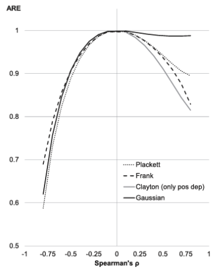{width=95%}

:::
::: {.column width="70%"}

 

**Example:** $\beta$ = mean of exponential marginals

**Note:**

-- large ARE gains irrespective of marginal parameter value

-- asymmetry - artifact of identification at upper Frechet bound in this example

-- half smaller $\mathbb{V}$, depending on Spearman's $\rho$; in other settings 90+% smaller

-- inconsistent if copula is not robust

:::
::::

<!-- ################################################################################################ -->

## Part 2 Semiparametrics {.center background-color="#2c3e50"}

:::: {.columns}
::: {.column}

  

1. Can consistent nonparametric estimators give a robust non-redundant copula?

2. How to obtain the asy variance for $\beta$?

3. What is the appropriate nonparametric estimator?

3. How much more efficiency can this produce, if any?
:::
::: {.column}
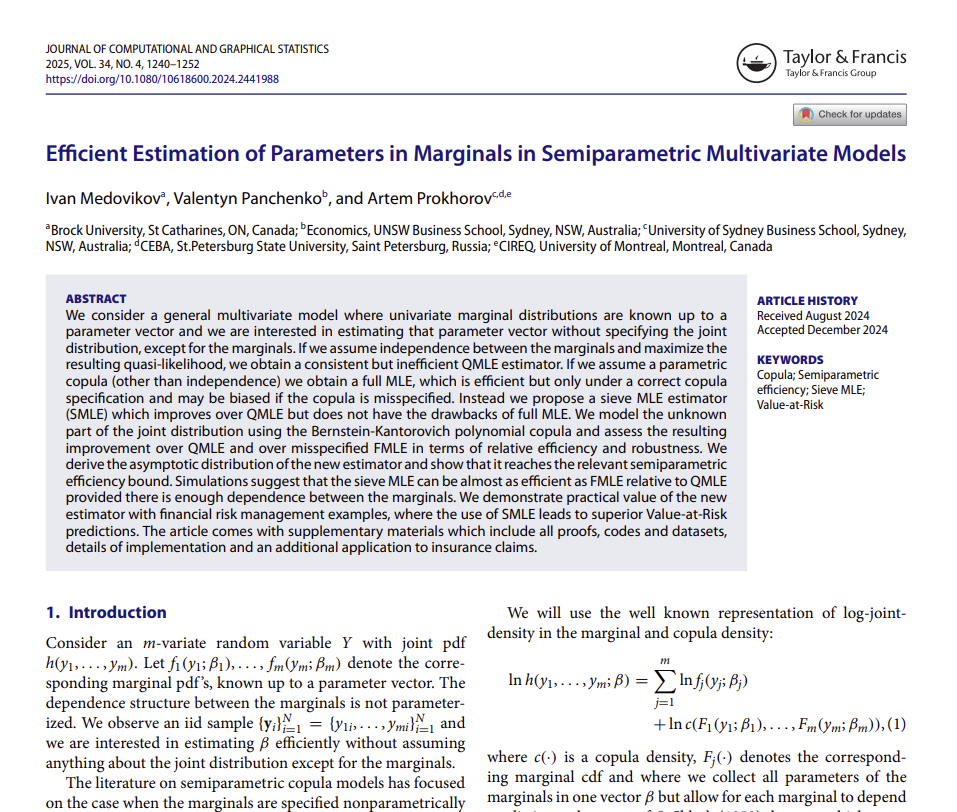
:::
::::

<!-- ################################################################################################ -->

## Semiparametric setup

**Note:** redundancy of parametric copulas is rare; it guarantees robustness but not vice versa.

Still possible to find the Holy Grail? 

**Semiparametrics:**  estimate $\beta$ along with the unknown copula  function. 

Consider Sieve MLE:

$$ \ln L(\beta, \gamma) =% \sum_{i=1}^N l_i(\beta, \gamma)= 
\sum_{i=1}^N [\ln f_1 (x_{1i}; \beta) + \ln f_2 (x_{2i}; \beta) + \ln \gamma(F_1 (x_{1i}; \beta) ; F_2 (x_{2i}; \beta))],
$$
where $\gamma(\cdot, \cdot)$ is a sieve approximator of unknown true $c(\cdot, \cdot)$.

**Robust and non-redundant**

- asy robust so long as $\ln \gamma$ is consistent for true $\ln c$.

- non-redundant so long as the score of $\ln \gamma$ is not in the span of marginal scores.

- should improve on efficiency over QMLE up to semiparametric lower bound for efficiency (SPLB).

- never as precise as FMLE.

## Sieve MLE

$$(\hat\beta, \hat\gamma) = \arg\max_{\beta, \gamma_N} \ln L(\beta; \gamma_N),$$

where $\gamma_N$ is a sieve approximator of $c_o$.

**Approximation and denseness**

- sieve is a set of  approximating spaces.

- approximate $\gamma \in \Gamma$ by parameters $\gamma_N \in \Gamma_N$.

- $\Gamma_N$ is dense in space of copula densities $\Gamma$: $\Gamma_N \rightarrow \Gamma$.

- sieve log-likelihood is maximised over $\beta$ and $\gamma_N$. 

- once $\dim{(\gamma_N)}$ is fixed, this is standard MLE over $\{\beta, \gamma_N\}$.

<!-- ################################################################################################ -->

## Useful sieves: tensor products

**Recall:** $c_o$ is a multivariate pdf with uniform marginals

**$M$-variate tensor product** of linear univariate sieves on $[0,1]$

$$\Gamma_N=\left\{\gamma_N(\mathbf{u})= \exp\left\{\sum_{j=1}^{J_N}a_{1j} A_j(u_1)\cdot\ldots \cdot \sum_{j=1}^{J_N} a_{Mj}A_j(u_M) \right\}\right.,\\ \left.\mathbf{u}\in [0,1]^M, \int_{[0,1]^M} \gamma_N(\mathbf{u})d\mathbf{u}=1, \int_{[0,1]^{M-1}} \gamma_N(\mathbf{u})d\mathbf{u}^{-l}=1, \forall l \right\}
$$

- $\dim(a)=J_N^M$, all interactions of $a_{ij}$'s.
- basis functions $A_j(u)$: power series, trigonometric polynomials, splines, or wavelets.
- **proper copula** conditions (integrability and marginal uniformity) not easy to satisfy with tensor product sieves.
- **boundary problem** -- estimation bias at boundaries of support.
- **boundary**: copula densities unbounded at $\{0,1\}$ and $\{1,1\}$, e.g., Plackett.

<!-- ################################################################################################ -->

## Useful sieves: Bernstein

**Bernstein-Kantorovich  polynomial sieve**

$$\Gamma_N = \left\{ \gamma_N(\mathbf{u})=J_N^M\sum_{j_1=0}^{J_N-1}\dots \sum_{j_M=0}^{J_{N}-1} \gamma(j_1, \ldots, j_M)\prod_{k=1}^M
\underbrace{{J_N-1 \choose j_k}
u_k^{j_k}(1-u_k)^{J_N-j_k-1}}_{\beta\text{-density}}\right\},
$$
where $\gamma(j_1, \ldots, j_M)\in[0,1]$ denotes $J_N^M$ polynomial parameters. 

**Note:**

- mixtures of $\beta$-densities $\Rightarrow$ easy to impose the **proper density** condition and **uniform marginals** condition through $\gamma$'s.

- no boundary effects, uniform convergence  on $[0,1]^M$.

- weights can be made adaptive and sparse -- see later.

- infeasible if $J_N^M>N \Rightarrow$ shrinkage, e.g., using L1-norm -- see later.

## Bivariate Bernstein copula
$$
c^B(u_1, u_2; \gamma_N) =  \sum_{i=0}^{J_N-1} \sum_{j=0}^{J_N-1}
\gamma_{ij} B_i(u_1) B_j(u_2),
$$
where
$$
B_i(u) \equiv J_N {J_N-1 \choose i} u^i (1 - u)^{J_N-1-i} \qquad  \gamma_N = \{\gamma_{ij}\}_{i,j=0, \ldots, J_N-1} 
$$

- can be viewed as histogram $\gamma_{ij}$, over $J_N \times J_N$ grid, smoothed with $\beta$-densities.

- $\{\gamma_{ij}\}$ need to form a doubly stochastic matrix: $\Gamma_N = \{\gamma_N \in \mathbb{R}_+^{J_N\times J_N}: \gamma_N \mathbf{1} = \frac{1}{J_N}\mathbf{1}, \gamma_N' \mathbf{1}= \frac{1}{J_N}\mathbf{1}\}$. 

- this ensures uniform marginals and integration to 1.

-  impose sparsity by requesting some $\gamma_{ij} =0$ while preserving double stochasticity.

<!-- ################################################################################################ -->

## Sieve-based likelihood and moment conditions

\br

$$
\ln L(\beta; \gamma_N) = \sum_{n=1}^N \left[\ln f_{1n}(\beta) + \ln f_{2n}(\beta) +\underbrace{\ln \sum_{i=0}^{J_N-1} \sum_{j=0}^{J_N-1}
\gamma_{ij} B_i(F_{1n}(\beta)) B_j(F_{2n}(\beta))}_{\ln  c_n^B(\beta; \gamma_N)}\right]
$$

Given $J_N$, this is standard MLE. Recall the 4 sets of moment conditions

$$\left.\begin{array}{c} \left. \begin{array}{c}
(a)\quad\mathbb{E}\nabla_\beta \ln f_1(\beta_o) =0 \\
(b)\quad\mathbb{E}\nabla_\beta \ln
f_2(\beta_o) =0
\end{array}\right\}\text{QMLE}\\
\left. \begin{array}{c}
(c)\quad \mathbb{E}\nabla_\beta \ln c^B(\beta_o,\gamma_N) =0 \\
(d)\quad \mathbb{E}\nabla\gamma \ln c^B(\beta_o,
\gamma_N) =0
\end{array}\right.
\end{array}\right\}\text{SMLE}
$$

::: {.textbox}
After some algebra: (c) is not in the span of (a) and (b), or in the span of (a), (b) and (d).

$\Rightarrow$ Bernstein copula is **generally non-redundant**
:::

Is it consistent?

<!-- ################################################################################################ -->

## Asymptotic normality and efficiency of SMLE

 
Standard MLE theory does not apply as $J_N\rightarrow\infty$ in SMLE problem:

$$\hat \theta = \arg \max_{B \times \Gamma_N} \ln L(\beta,\gamma_N)$$

<!-- Econometric folklore: SMLE is asymptotically efficient -->

Let $\theta=(\beta, \gamma)$. Consider functional $\rho: \Theta \rightarrow R$; e.g. $\rho(\theta)=\mathbb{E} \nabla \ln c$ or $\rho(\theta)=\lambda'\beta$,
$\lambda \in \mathbb{R}^p$.

Regularity conditions

::: {.f70}

**A1 (identification)** 

 $\beta_o \in \int(B)\subset R^p$;

 $B$ is compact; 

 there exists a unique $\theta_o$ which maximizes $\mathbb{E} [\ln h(\mathbf{X}_i;\theta)]$ over $\Theta=B \times \Gamma$.

**A2 (smoothness)** 

 $\Gamma = \{c=\exp(g):g\in \Lambda^r([0,1]^m), \int c(\mathbf{u}) d\mathbf{u} = 1\}$, where $\Lambda^r([0,1]^m)$ denotes the Holder class of $r$-smooth functions on  $[0,1]^m, r>1/2,$;

 $\ln f_j(\beta), j=1,\ldots, m,$ are twice continuously differentiable w.r.t. $\beta$.

**A3 (nonsingular information)** 

 $\mathbb{E}S_\beta S_\beta'$ is finite and positive definite.

**A4 (convergence of sieve MLE and smoothness of higher order term in Taylor expansion)** 

 $||\hat{\theta}-\theta_o ||=O_P(\delta_N)$ for $(\delta_N)^{w} = o(N^{-1/2})$, $w>1$; 

 there exists $\Pi_N \nu^* \in V_N - \{\theta_o\}$ such that $\delta_N ||\Pi_N \nu^* - \nu^*||=o(N^{-1/2})$;

 for any $\theta:||\theta-\theta_o||=O_p(\delta_N)$, the expected directional derivative $\mathbb{E} \frac{d\, \dot{l}(\theta)[\nu]}{d \theta'}[\nu]  \le ||\nu||^2$.

:::

::: {.textbox}
**Theorem:** under regularity conditions, copula-based plug-in SMLE is asymptotically normal and semiparametrically efficient, i.e.

$\sqrt N (\rho(\hat \theta)-\rho(\theta_o)) \rightarrow N(0,\Omega), 
\text{ where }\Omega = \text{ SPLB }$
:::

- This is a generalization of Delta methods, aka Slutsky Theorem, to functionals.
- Most efficient among semiparametric estimators using the same information
- If $\sqrt N (\lambda'(\hat \beta-\beta_o)) \rightarrow N(0,\Omega)$ then  $\sqrt N(\hat \beta-\beta_o)$ is also asymptotically normal and efficient by the Cramer-Wold device

- (!) $\sqrt{N}$ convergence, even if the nonparametric part of $\hat{\theta}$ converges slower.

<!-- ################################################################################################ -->

## Efficiency bounds

 

 Recall parametric asymptotic efficiency 

::: {.f80}

- Regular estimator $\hat \theta$ of $\theta_o$ such that $\sqrt N(\hat \theta-\theta_o) \rightarrow N(0,\mathbb{V}_\theta) \Rightarrow \mathbb{V}_\theta \geq I_F^{-1}$, full Fisher information $I_F=\mathbb{E}_{\theta_o}(S_\theta S_\theta')$, $S_\theta=\nabla_\theta \ln f(\theta)$

- Estimator is efficient when $\mathbb{V}_\theta = I_F^{-1}$.  FMLE is efficient.

- Now suppose $\theta=(\beta',\gamma')'$; $\beta_o$ is of interest, $\gamma$ is nuisance parameter.

- How to find variance of $\hat{\beta}$? Introduce function $\beta=\rho(\theta)$. Then, by Delta method, 

$$\sqrt N( \rho(\hat \theta)-\rho(\theta_o)) \rightarrow N(0,\mathbb{V}_\beta), \text{ where } \mathbb{V}_\beta=(\nabla \rho)' \mathbb{V}_\theta ( \nabla \rho)$$

- $\mathbb{V}_\beta\ge i_\beta^{-1}$, where  $i_\beta=\mathbb{E}_{\theta_o}(S_{\beta}-P S_{\gamma})(S_{\beta}-P S_{\gamma})'$  is marginal Fisher information.

**Geometric interpretation:** $i_\beta$ is variance of error in projection of $S_\beta$ onto $span \{S_{\gamma}\}$.

**Linear algebra interpretation:**  $i_\beta^{-1}=\left(I_{\beta\beta}-I_{\beta\gamma}I_{\gamma\gamma}^{-1}I_{\gamma\beta}\right)^{-1}$ upper left block of $I_F^{-1}$. 

:::

**Semiparametric asymptotic efficiency**

- Model with nonparametric component is at least as hard as any one-dimensional submodel that satisfies semiparametric assumptions.

- Parameterise the semiparametric model: $\theta(t)=\theta_o+t\nu$, where $\nu \in$ tangent space. 

<!-- \bar{V}(\Theta,\theta_o)$ closed linear span of $\Theta - \{\theta_o\}$ (Tangent space) -->

- Estimating $\theta_o$ is at least as hard as estimating $t$ ("true" $t=0$).

- Semiparametric lower bound is the supremum over the traditional Cramer-Rao bounds (infimum over Fisher informations) for estimating $t$ for all suitable parametric submodels.

**Note:** 

$I_{\theta(t)} = \mathbb{E}_{\theta_o} S_{\theta(t)} S_{\theta(t)}'$ $\qquad$ $S_{\theta(t)}=\frac{\partial l(\theta(t))}{\partial t}=\frac{\partial l(\theta)}{\partial \theta} [\nu]$.

SPLB $= \sup_{\nu} I_{\theta(t)}^{-1} \ge I_F^{-1}$. 

<!-- ################################################################################################ -->

## What is our SPLB?

Recall $\rho(\theta)=\lambda'\beta$, semiparametric model $\ln h(\theta_o) = \ln f_{1}(\beta_o) + \ln f_2(\beta_o)+\ln c^B(\beta_o,\gamma_o)$,
parametric submodel $\theta(t)=\theta_o+t\nu.$ 

What is $I_{\theta(t)}$ here?

Define directional derivative of sieve log-density  in direction $\nu = (\nu_\beta', \nu_\gamma')'$.

$$
S_{\theta(t)}=\dot{l}(\theta_o)[\nu]  %\equiv  \lim_{t\rightarrow 0} \left.\frac{\ln h  (\theta_o+t\nu)- \ln h(\theta_o)}{t}\right|_{t=0}
= \frac{\partial \ln h (\theta_o, x)}{\partial \theta'}[\nu]= \frac{\partial \ln h (\theta_o)}{\partial \beta'}\nu_\beta+\frac{\partial \ln h (\theta_o)}{\partial \gamma'}\nu_\gamma
$$

Recall Fisher information for $t$ is $\mathbb{E}_{\theta_o} S_{\theta(t)} S_{\theta(t)}'$. So Fisher informations for estimating our submodels are 
$$I_{\theta_t}=\mathbb{E}_{\theta_o}
\left[\dot{l}(\theta_o)[\cdot]\dot{l}(\theta_o)[\cdot] \right]$$ 
and 
$$\text{SPLB} = \sup_{\nu \ne 0} I_{\theta_t}^{-1} \text{ over relevant submodels}.$$ 

<!-- ################################################################################################ -->

## SPLB and least favourable direction

<!--
TheoremHow to find the $\sup$?

- Look over relevant submodels:

Recall the functional $\rho(\theta)=\lambda'\beta$

Restrict parametric submodels $\rho(\theta(t))=t$ ("estimating $\rho$ $\Leftrightarrow$ estimating $t$")

- This requires further normalization of  $||\nu||$ that directional derivative of $\rho(\theta(t))$ is 1.

Define directional derivative of $\rho(\theta)$ in direction $\nu = (\nu_\beta', \nu_c')'$

$$\dot{\rho}(\theta_o)[\nu] \equiv \lim_{t\rightarrow 0} \left.\frac{\rho (\theta+t\nu)-
\rho(\theta)}{t}\right|_{\theta=\theta_o} =\lambda' \nu_\beta= \rho(\nu)$$

So the restriction we need is that $\frac{\partial \rho(\theta(t))}{\partial t} = \frac{\partial \rho(\theta)}{\partial \theta'}[\nu]=\lambda' \nu_\beta=1$
-->

::: {.textbox}

**Theorem:** $\text{SPLB} =\lambda' \left( \mathbb{E}_{\theta_o} S^{\ast}_\beta S^{\ast'}_\beta \right)^{-1}\lambda$, where

::: {.f70}

$$ S^{\ast'}_\beta  =  \overbrace{\sum_{j=1}^2 \left\{ \nabla_\beta \ln f_j(\beta_o) +\left.\left( \frac{1}{c (u_1, u_2)} \nabla_{u_j} c (u_1,u_2)\right)\right|_{u_k=F_k(\beta_o)} \nabla_\beta F_j(\beta_o) \right\} }^{S_\beta} + \underbrace{\frac{1}{c (u_1, u_2)} g^*(u_1, u_2)|_{u_k=F_k(\beta_o)} }_{ \text{analogue of }-PS_{\gamma} } 
$$

:::

and $(g_1^*, \ldots, g_p^*)$ are solutions to 

::: {.f70}
$$\inf_{g_q} \mathbb{E}_{\theta_o}\left[ \sum_{j=1}^2 \left\{ \nabla_{\beta_q} \ln
f_j(\beta_o) + \left.\left(\frac{1}{c
(u_1, u_2)} \nabla_{u_j} c
(u_1, u_2)\right)\right|_{u_k=F_k(\beta_o)}
\nabla_{\beta_q} F_j(\beta_o) \right\}
+ \left.\frac{1}{c(u_1, u_2)} g_q(u_1,u_2)\right|_{u_k=F_k(\beta_o)}
\right]^2
$$ 

:::
:::

**Note:** 

::: {.f80}

- analogous to $i_\beta=\mathbb{E}_{\theta_o}(S_{\beta}-P S_{\gamma})(S_{\beta}-P S_{\gamma})'$.

- least favorable direction $\nu^*_\gamma$: $\frac{1}{c (\mathbf{u})} g^*(u_1, \ldots, u_m) = - \nabla_{\gamma} \ln h (\theta_o)\cdot\nu^*_\gamma$.

- least favorable direction is not independence unless true copula is independence.

- no numerical redundancy.

- corollary: $\sqrt N (\hat \beta-\beta_o) \rightarrow Nt(0,( E S^{\ast}_\beta S^{\ast'}_\beta)^{-1})$, semiparametrically efficient.
:::

<!-- ################################################################################################ -->

## Least favourable direction: close-form for Bernstein sieve
::: {.f70}
Write the Bernstein sieve
$$
c_B(u;\gamma) = b(u)'\gamma, \quad \text{ where } u = (u_1, u_2), \quad b(u)=
\left[
B_i(u_1)B_j(u_2)
\right]_{i,j}, \quad \gamma = \left[\gamma_{ij}\right]_{i,j}.
$$
Look at $c_B$ at a local perturbation $\gamma_t=\gamma_0+t\delta$:
$$
c_B(u; \gamma_o+t\delta) = b(u)'\gamma_o+t b(u)'\delta \quad \Rightarrow \quad g(u)
=
\left.
\frac{\partial}{\partial t}
c_B(u;\gamma_t)
\right|_{t=0}
=
b(u)'\delta.
$$
**Note:** nuisance tangent space = span of Bernstein bases.

The efficient score satisfies

$$S_{\beta}^*
=
S_{\beta}
+
\frac{g_q^*(u)}
{c_B(u; \gamma)} = S_{\beta}
+
\frac{b(u)'\delta^*}
{c_B(u; \gamma)},
$$ 

where

$$ \delta^*
=
\arg\min_\delta
\mathbb{E}\left[
S_{\beta}
+
\frac{b(u)'\delta}
{c_B(u;\gamma)}
\right]^2.
$$

Solve for $\delta^*$: 
$$\delta^* = - \left[\mathbb{E}\frac{b(u)b(u)'}{c_B(u;\gamma)}\right]^{-1} \mathbb{E}S_\beta b(u)\quad \Rightarrow \quad
\boxed{
S_{\beta}^*
=
\underbrace{S_{\beta}}_{\text{raw score}}
-
\underbrace{\frac{b(u)'}
{c_B(u; \gamma)}\left[\mathbb{E}\frac{b(u)b(u)'}{c_B(u;\gamma)}\right]^{-1} \mathbb{E}S_\beta b(u)}_{\text{projection onto nuisance space}}.
}
$$

- project the parametric score onto the span of the Bernstein basis functions. 

- least favourable direction is a Bernstein polynomial itself; it's the optimal linear combination of 
Bernstein bases that best approximates the nuisance component of the score. 

:::
<!-- ################################################################################################ -->

## How much more efficiency?

Asy Relative Efficiency (ARE) of FMLE and SMLE vs QMLE: $$\frac{\mathbb{V}_\text{FMLE}}{\mathbb{V}_\text{QMLE}} \quad \& \quad \frac{\mathbb{V}_\text{SMLE}}{\mathbb{V}_\text{QMLE}}$$

**Example:** $\beta$ = mean of exponential marginals

:::: {.columns}
::: {.column width="30%"}

FMLE

{width=95%}

:::
::: {.column width="30%"}

SMLE

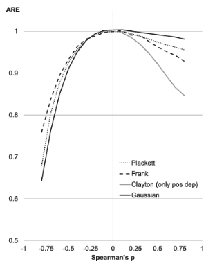{width=95%}

:::
::: {.column width="40%"}

 

**Example:** $\beta$ = mean of exponential marginals

**Note:**

-- large ARE gains of SMLE 

-- SMLE almost as efficient as FMLE

-- ARE gains monotone in Spearman's $\rho$

:::
::::

<!-- ################################################################################################ -->

## Part 3 Machine Learning {.center background-color="#2c3e50"}

:::: {.columns}
::: {.column}

  

1. How to make use of natural sparsity of copulas?

2. Neyman orthogonality as moment redundancy.

3. Asymptotics for double machine learning SMLE.
:::
::: {.column}
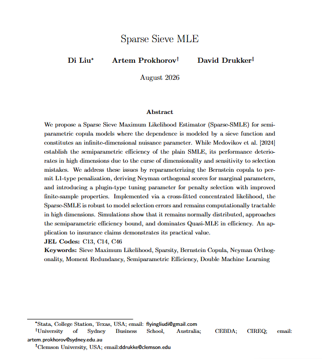
:::
::::

<!-- ################################################################################################ -->

## Natural sparsity 

Many $\gamma_{ij}$'s in Bernstein approximator are close to zero. Copula densities are intrinsically sparse. Sparser for stronger dependence, e.g., as measured by Kendall's $\tau$: 

::: {.f60}

:::: {.columns}
::: {.column width=25%}
&nbsp;&nbsp; Independence
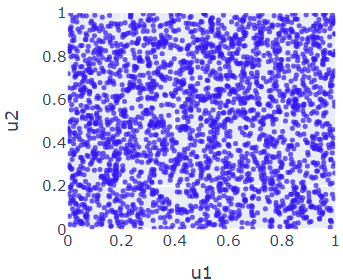
:::
::: {.column width=25%}
&nbsp;&nbsp; Gumbel ($\tau = 0.5$)
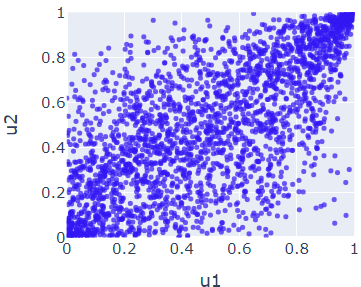
:::
::: {.column width=25%}
&nbsp;&nbsp; Gumbel ($\tau = 0.66$)
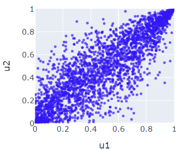
:::
::: {.column width=25%}
&nbsp;&nbsp; Gumbel ($\tau = 0.87$)
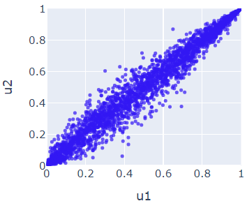
:::
::::
:::
<!-- https://copula-generation-examples.vercel.app/ -->

**Machine Learning** 

::: {.f80}

- operates under $\dim(\gamma_N)>>N$: requires regularisation, introduces regularisation biases, in addition to SMLE bias due to truncation of $J_N$

- is known for optimally trading bias for variance and achieving excellent predictive power

- has **double**, or **robust**, debiased ML version that restores Gaussian asymptotics

:::

Can it help find the holy grail?

## Sparse SMLE 

Many ML methods exist (LASSO, RF, GBDT, DNN, etc). 

Look at LASSO, i.e. L1-norm penalisation, on Bernstein parameters $\gamma_{ij}$'s.

How to estimate $\beta_o$ consistently allowing for regularisation bias in estimating $\gamma_o$?

**What won't work**

::: {.f80}

**Naive L1-regularisation: one-step**

$$
(\hat{\beta}, 
\hat{\gamma}) = \arg
\min_{\beta, \gamma_N} -\ln L^S(\beta; \gamma_N) + \lambda \sum_{i,j}|\gamma_{ij}|, \qquad \gamma_N = \{\gamma_{ij}\}_{i, j=0, \ldots, J_N-1}
$$
where 

::: {.f70}

$$\ln L(\beta; \gamma_N)= \sum_{n=1}^N \left[ \ln f_{1n}(\beta) + \ln f_{2n}(\beta) +\underbrace{\ln \sum_{i=0}^{J_N-1} \sum_{j=0}^{J_N-1}
\gamma_{ij} B_i(F_{1n}(\beta)) B_j(F_{2n}(\beta))}_{\ln  c_i^B(\beta; \gamma_N)}
\right]
$$
:::

:::: {.columns}
::: {.column width=50%}

**Note**

- regularisation and truncation biases
- $\hat{\gamma}$ is not a proper copula, let alone a robust copula
- often produces bi-modal sampling density of $\hat\beta$ in sims
- irrelevant for efficiency comparisons
:::

::: {.column width=50%}

::: {.f60}
&nbsp;&nbsp; Naive SMLE for $\mu_o=1$, Plackett copula, near negative Frechet bound
:::
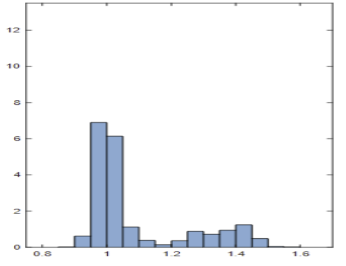

:::
:::: 

:::

<!-- ################################################################################################ -->

## How to make ML estimators robust? 

Want $\hat\beta$ to be insensitive to deviations of $\hat\gamma$.

Why does LASSO break? 

Assume $\dim(\gamma_N)<N$. 

Recall the moments from FMLE: 

$$\left.\begin{array}{c} \left. \begin{array}{c}
(a)\quad\mathbb{E}\nabla_\beta \ln f_1(\beta_o) =0 \\
(b)\quad\mathbb{E}\nabla_\beta \ln
f_2(\beta_o) =0
\end{array}\right\}\text{QMLE}\\
\left. \begin{array}{c}
(c)\quad \mathbb{E}\!\nabla_\beta \ln k(\beta_0,\gamma_0^k)\ne 0 \\
(d)\quad \mathbb{E}\!\nabla_\gamma \ln k(\beta_0,\gamma_0^k)\ne 0
\end{array}\right.
\end{array}\right\}\text{SMLE}
$$

Penalisation invalides $(c)$ and $(d)$ even if they were correct. This causes inconsistency of $\hat\beta$ There is a pseudo-true value that sets relevant F.O.C. equal to zero. 

$$(*)\quad\left\{\begin{matrix}
\mathbb{E}\nabla_\beta \ln c^B(\beta_o^*,\gamma_N^*) =0
\\
\mathbb{E}\nabla\gamma \ln c^B(\beta_o^*, \gamma_N^*) =0
\end{matrix} \right. 
$$

LASSO bias carries over to $\hat\beta$. When does estimation of ${\gamma}$ not affect estimation of $\beta$? 

## When does estimation of ${\gamma}$ not affect estimation of $\beta$? 

Turns out our earlier results apply:

Whenever it is irrelevant for the estimation of $\beta$ whether we know $(d)$ and the true $\gamma_o$. 

Let  $g_1=s_\beta = (a)+(b)+(c)$ and $g_2=s_\gamma=(d)$. 

<!--
C:=\mathbb{E}\left[\begin{array}{cc}h_{i1}h_{i1}' & h_{i1}h_{i2}'\\
h_{i2}h_{i1}' & h_{i2}h_{i2}'\end{array}\right]=\left[\begin{array}{cc}C_{11} & C_{12}\\
C_{21} & C_{22}\end{array}\right]\text{ and }D:=\mathbb{E}\left[\begin{array}{cc}\nabla_\beta h_{i1} & \nabla_\delta h_{i1}\\
\nabla_\beta h_{i2} & \nabla_\delta h_{i2}\end{array}\right]=\left[\begin{array}{cc}D_{11} & D_{12}\\
D_{21} & D_{22}\end{array}\right]$ 
-->
Notation: $\quad \mathbb{D}_1=\left[\begin{array}{c}\mathbb{E}\nabla_\theta
g_1 \\ \mathbb{E}\nabla_\theta g_2\end{array}\right] = \left[\begin{array}{c}\mathbb{D}_1 \\ \mathbb{D}_2\end{array}\right]\qquad \mathbb{C}=\left[\begin{array}{cc}\mathbb{E}g_1 g_1'&\mathbb{E}g_1 g_2' \\ \mathbb{E}g_2 g_1'&\mathbb{E}g_2 g_2'\end{array}\right] =\mathbb{V}\left[\begin{array}{c} g_{1}\\
g_{2}\end{array}\right] = \left[\begin{array}{cc} \mathbb{C}_{11}& \mathbb{C}_{12}\\
\mathbb{C}_{21}&\mathbb{C}_{22}\end{array}\right]$

**M/P-Redundancy** $$ \Leftrightarrow \begin{array}{cl}
 \mathbb{C}_{12}=0  &\text{Moment redundancy}   \\
 \mathbb{D}_{12}=\mathbb{E}\nabla_\gamma g_{1}(\beta_o, \gamma_N)=0  &  \text{Parameter redundancy} 
\end{array}$$

Look for a valid moment function $g^*_{1}(\beta, \gamma)$ uncorrelated with $g_{2}$ such that $$\mathbb{D}_{12}=\mathbb{E}\nabla_\gamma g_{1}^*(\beta_o, \gamma_N)=0.$$

Obvious answer: use error in projection 

$$
\boxed{
g^*_1(\beta, \gamma) = g_{1}(\beta_o, \gamma_N) - \mathbb{C}_{12}\mathbb{C}_{22}^{-1}g_{2}(\beta_o, \gamma_N)
}
$$
<!--
**Note** under correct specification, $s_\beta^*
=
(a)+(b)+
\left((c)-\mathbb{C}_{12}\mathbb{C}_{22}^{-1}(d)\right) = (a)+(b)+
\left((c)-\mathbb{D}_{12}\mathbb{D}_{22}^{-1}(d)\right) $.
-->

## Neyman orthogonality

Now let $d=\dim(\gamma)=\infty$ [$\gamma$ is a function]

In context of asy optimal testing: when errors in  $\hat{\gamma}$ do not carry over into $\hat\beta$

A moment is Neyman orthogonal if it is locally insensitive, to first order, to perturbations of the nuisance parameter. 

Formally, for every admissible direction $\gamma$ in the nuisance tangent set,

$$\textbf{Neyman Orthogonality } \Leftrightarrow\left.\begin{array}{cl}
 \mathbb{D}_{12}[\gamma-\gamma_o]=0 & \text{ Gateaux derivative}  
\end{array}\right.$$

Look for a valid moment function $g^*_{1}(\beta, \gamma)$ such that 

$$\mathbb{D}_{12}[\gamma-\gamma_o] = \partial_\gamma \mathbb{E}g_{1}^*(\beta_0, \gamma_o)[\gamma-\gamma_o] = \lim_{\tau\rightarrow 0} \frac{\mathbb{E}g_{1}^*(\beta_o, \gamma_o+\tau(\gamma-\gamma_o))-\mathbb{E}g_{1}^*(\beta_o, \gamma_o)}{\tau}=0$$

Turns out this is the orthogonal score we found when establishing SPLB.

Close-form for Bernstein sieve: 

$$s_{\beta}^*
=
\underbrace{s_{\beta}}_{\text{raw score}}
-
\underbrace{\frac{b(u)'}
{c_B(u; \gamma)}\left[\mathbb{E}\frac{b(u)b(u)'}{c_B(u;\gamma)}\right]^{-1} \mathbb{E}s_\beta b(u)}_{\text{projection onto nuisance space}}.$$

Use cross-fitting, to estimate $\gamma$ and projection on the auxiliary sample, while this moment equation is evaluated on the held-out sample.

## Profile likelihood 

**Equivalent** -- see paper 
$$
\alpha^*_\beta = \arg
\min_{\alpha \in R^{J_N^2}} - \frac{1}{N}\sum_{n=1}^N
\sum_{i, j} \gamma(\alpha_{ij}^2) B_i(F_{1n}(\beta)) B_j(F_{2n}(\beta))
+ \lambda \sum_{i, j} |\alpha_{ij}|,
$$

where we use reparameterisation $\gamma_{ij} = \gamma(\alpha_{ij}^2)$ via Sinkhorn algorithm to impose doubly stochastic $\gamma_{ij}$ while keeping sparsity intact.

<!-- ################################################################################################ -->

## Double machine learning SMLE algorithm

- Obtain a consistent estimate of $\beta$ using QMLE, denote it $\hat{\beta}_a$.

- Divide data into $K$ folds. For each fold $k=1$ to $K$, do the following:

-- Let data in fold $k$ be the main sample $D_{m}(k)$. Let the rest of data be the auxilary sample $D_{a}(k)$.

-- Obtain the solution to profile likelihood problem using $\hat{\beta}_a$ as initial values in three steps: 

Step 1. use $D_{a}(k)$ to obtain estimates of penalised $\gamma_{ij}$. 

Step 2. use $D_{a}(k)$ to obtain estimates of $\gamma_{ij}$ using only the non-zero $\gamma_{ij}$ picked in Step 1. 

Step 3. use $D_{main}(k)$ to obtain $\hat{\beta}(k)$. 

- Estimate $\beta$ as the average over folds: 
$$
\hat{\beta} = \frac{1}{K} \sum_{k=1}^K \hat{\beta}(k)
$$

<!-- ################################################################################################ -->
## Asymptotics for DML-SMLE

:::{.textbox}
**Theorem** Under regularity assumptions, the DML-SMLE is asymptotically
  distributed as
  $$ \sqrt{N}(\hat{\beta} - \beta_0) \rightarrow N(0, V), $$
  where 
 $$V = \mathbb{D}_{11}^{-1}\mathbb{E}[s_\beta^* s_\beta^{*'}]\mathbb{D}_{11}^{-1}.$$
:::

E.g., Naive SMLE and DML-SMLE for $\mu_o=1$, Plackett copula, near lower Frechet bound. $N=1000$, based on 1000 reps:

:::: {.columns}
::: {.column width=20%}
::: {.f60}
&nbsp;&nbsp; Naive SMLE  
:::
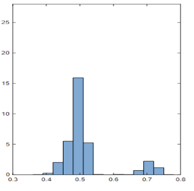
:::

::: {.column width=20%}

::: {.f60}
&nbsp;&nbsp; DML-SMLE
:::
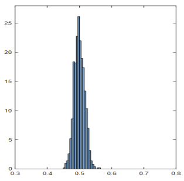
:::

::: {.column width=60%}
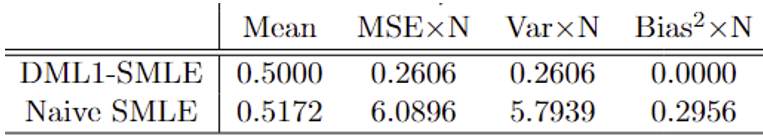
:::

:::: 

<!-- ################################################################################################ -->

## Conclusions and promising directions

- robust and efficiency-improving copulas are a Holy Grain of dependence modeling. 

- parametric robust and efficiency-improving copulas are rare.

- parametric copulas are redundant if their scores are in a linear span of marginal scores. 

- robust copulas are often robust because they are redundant. 

- sieves offer an attractive nonparametric alternative in cases of strong dependence.

- Bernstein sieve offers an close-form for SPLB and penalised robust SMLE.

- Neyman orthogonality can be viewed in terms of moment redundancy. 

- double machine learning helps achieve robustness and improve efficiency over naive penalised SMLE.

- many directions for future work including specific results for non-LASSO, non-Bernstein maching learning methods known to handle high dimensions and sparsity effectively, e.g., DNN, GRF, MIP

<!-- ################################################################################################ -->

## Collaborators {.center}

:::: {.columns}

::: {.column width="20%"}

{width=95%}

**David Drukker**

Clemson U

:::

::: {.column width="20%"}

{width=95%}

**Di Liu**

StataCorp

:::

::: {.column width="20%"}

{width=95%}

**Ivan Medovikov**

Brock U

:::

::: {.column width="20%"}

{width=95%}

**Valentyn Panchenko**

UNSW

:::

::: {.column width="20%"}

{width=95%}

**Peter Schmidt**

Michigan State U

:::

::::